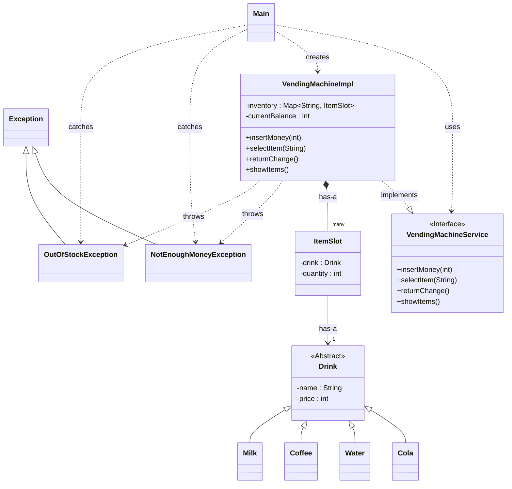

# ☕ Java 객체지향 콘솔 자판기 미니 프로젝트

Java의 핵심 객체지향(OOP) 원칙과 예외 처리, 그리고 컬렉션 프레임워크(Map)의 올바른 사용법을 학습하고 증명하기 위해 제작된 프로젝트입니다.
## 1. 프로젝트 개요 (Overview)

이 프로젝트는 단순히 자판기의 기능을 구현하는 것을 넘어, 현업 개발에서 중요하게 다루어지는 설계의 명확성과 코드의 안정성을 확보하는 데 중점을 두었습니다. 

특히 초보자가 흔히 저지를 수 있는 실수(예: List의 무분별한 사용, if-else로만 오류 처리)를 배제하고, 왜 이 기술을 사용했는지에 대한 근거를 코드로 보여주고자 했습니다.

* **객체지향 설계 (OOP):** `Drink` 추상 클래스를 이용한 **상속** 활용, `VendingMachineService` **인터페이스**를 통한 역할과 구현의 분리(SRP)를 적용했습니다.
* **자료구조 선택:** `List`가 아닌 `Map`을 선택했습니다. A1이라는 `Key`로 상품(`Value`)에 O(1)의 속도로 접근하는 것이 자판기 로직에 가장 효율적임을 증명합니다.
* **안정적인 예외 처리:** `if-else` 대신 `try-catch`와 사용자 정의 예외(Custom Exception)**를 사용했습니다. 이를 통해 [재고 부족]과 [잔액 부족]이라는 비즈니스 로직 상의 오류를 핵심 로직과 분리하여 안정적으로 처리했습니다.

## 2. 주요 기술 스택 (Tech Stack)

* **Language:** Java
* **Core Concepts:** OOP (Inheritance, Abstraction, Interface), Custom Exception Handling
* **Framework:** Collections Framework (`HashMap`)
* **IDE:** Eclipse
* **Version Control:** Git, GitHub

---

## 3. 실행 화면(Test Case 1: 잔액 부족 테스트)

프로그램을 실행했을 때의 기본 화면과 사용자가 상호작용하는 예시입니다.

### a. (Test Case 1: 잔액 부족 테스트)
- 잔고 0원으로 커피 구매 시도 -> [잔액부족]메세지 송출\
 \

### b. (Test Case 2: 정상 작동 테스트)

- 금액투입(5000원) -> 커피구매(1500원) -> 잔액표시(3500원)\

### c. (Test Case 3: 재고 부족 테스트)

- 커피(품절 상태) 구매시도 -> [재고부족] 메세지 송출\

## 4. 프로젝트 핵심 설계 (Class Diagram)

A. exception 클래스는 따로 분리하여 재사용할 수 있는 구조로 만들것

com.vendingmachine.exception이라는 별도의 패키지(폴더)에 NotEnoughMoneyException.java와 OutOfStockException.java를 분리.

com.vendingmachine.exception 패키지를 그대로 가져와서 NotEnoughMoneyException을 재사용 가능.
 

B. SRP: 예외 처리 로직을 핵심 로직에서 분리

- 비즈니스 로직(VendingMachineImpl.java):

역할: 자판기의 핵심 규칙(재고 검사, 돈 검사)을 담당합니다.

책임: 오류가 발생했음을 알리기만 합니다.(처리하지 않음)

코드: throw new OutOfStockException(...)

- 예외 처리 로직(Main.java):

역할: 사용자 입력을 받고, 프로그램의 흐름을 제어합니다.

책임: 비즈니스 로직이 알려준 오류를 처리합니다.

코드: catch (OutOfStockException e) { System.out.println(e.getMessage()); }

========================================================
## 5. 에러&오류 개선 처리과정

이 프로젝트는 코드의 효율성과 안정성을 높이기 위해 다음과 같은 리팩토링 과정을 거쳤습니다.

---

### 1-1. 재고 관리 방식 (List $\rightarrow$ Map)

**[BEFORE]** (ArrayList)
<VendingMachineImpl.java>  
  
  
  

▼ ▼ ▼ ▼

**[AFTER]** (Map)
<VendingMachineImpl.java>  

**개선 이유:**
-   처음에는 `ArrayList`로 재고를 관리하려 했습니다.
-   하지만 'A1'을 구매할 때마다 `for`문으로 리스트 전체를 탐색(O(n))하는 것이 매우 비효율적이라고 판단했습니다.
-   'A1'이라는 **Key**로 재고(`ItemSlot`)라는 **Value**를 즉시(O(1)) 찾아낼 수 있는 **`HashMap`**으로 자료구조를 리팩토링하여 성능을 최적화했습니다.

---

### 1-2. 오류 처리 방식 (if-else $\rightarrow$ Exception)

<VendingMachineImpl.java> 변경(전/후)

**[BEFORE]**
 

▼ ▼ ▼ ▼

**[AFTER]**
 

 

< Main.java> 변경(전/후)

**[BEFORE]**
 

▼ ▼ ▼ ▼

**[AFTER]**
 

**개선 이유:**
-   구매 실패 시 `false`를 반환하도록 만들었으나, 이 방식은 `Main`에서 `false`가 '재고 부족' 때문인지, '잔액 부족' 때문인지 구별할 수 없는 문제가 있었습니다.
-   이 문제를 해결하기 위해 `NotEnoughMoneyException`과 `OutOfStockException`이라는 **사용자 정의 예외(Custom Exception)**를 만들어 `throw`하도록 수정했습니다.
-   그 결과, `Main`에서는 `try-catch`를 통해 실패 원인을 명확하게 파악하고 사용자에게 정확한 안내 메시지를 보여줄 수 있도록 코드를 개선했습니다.

---

### 1-3. 사용자 입력 방어 (무방비 $\rightarrow$ try-catch)

<Main.java> 변경(전/후)

**[BEFORE]**
 

▼ ▼ ▼ ▼

**[AFTER]** 

**개선 이유:**
-   테스트 도중 메인 메뉴에서 숫자 대신 문자를 입력하면 `InputMismatchException`이 발생하며 프로그램이 다운되는 오류를 발견했습니다.
-   이를 해결하기 위해 `while` 루프의 메인 로직 전체를 **`try-catch` 블록**으로 감쌌습니다.
-   이제 잘못된 문자가 입력되어도 프로그램이 죽지 않고, 사용자에게 안내 메시지를 보여준 뒤, `scanner.next()`로 버퍼를 비워 안정적으로 다음 입력을 대기하도록 수정했습니다.

**[개선 결과]**

