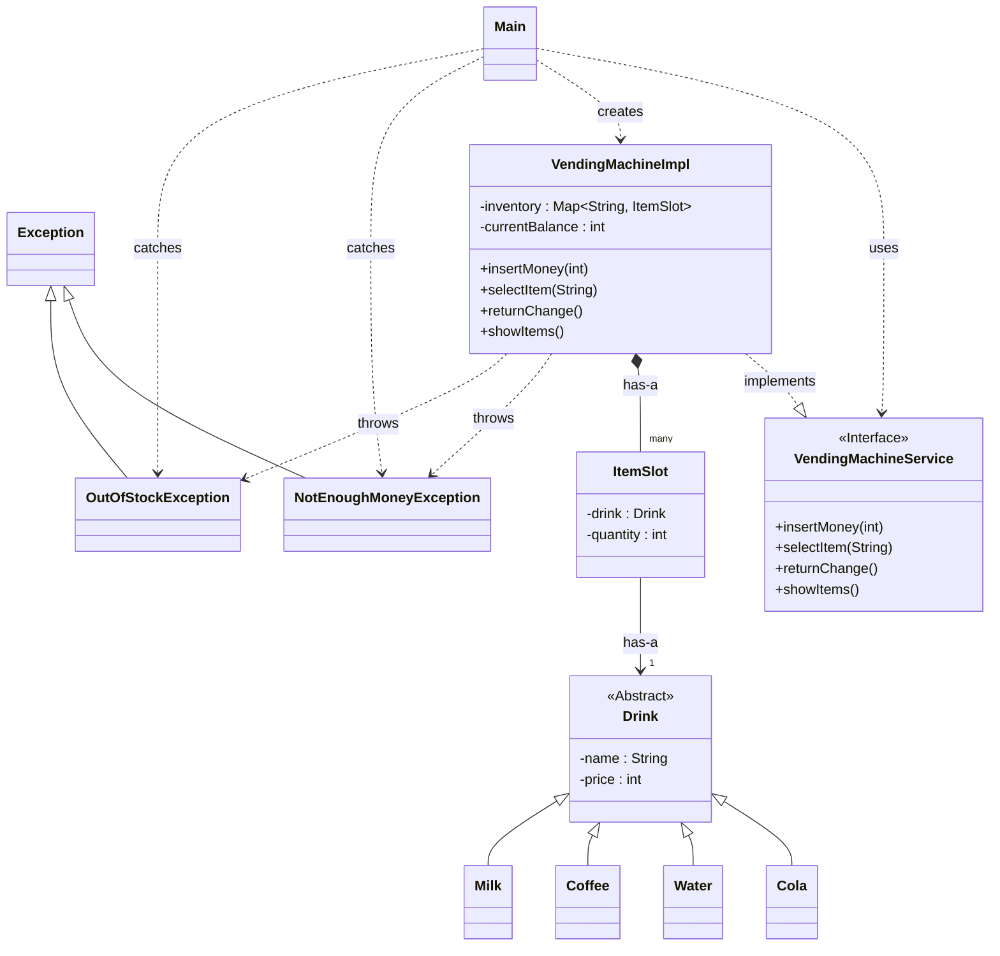

# ☕ Java 객체지향 콘솔 자판기 미니 프로젝트

이 프로젝트는 Java의 핵심 OOP 원칙(상속, 인터페이스)과 예외 처리,
그리고 컬렉션 프레임워크(`Map`) 사용을 목적으로 진행되었습니다.

## 1. 실행 화면

프로그램을 실행했을 때의 기본 화면과 사용자가 상호작용하는 예시입니다.

## 2. 프로젝트 핵심 설계 (Class Diagram)

## 3 에러&오류 개선 처리과정

1-1 재고 관리 방식 (List => Map)

@ BEFORE 코드작성 (ArrayList)  
<VendingMachineImpl.java>   

  \
  \
\

                ▼    ▼    ▼    ▼

@ AFTER 코드작성 (Map)
<VendingMachineImpl.java>  현재 코드)

\

처음에는 ArrayList로 재고를 관리하려 했습니다.
하지만 'A1'을 구매할 때마다 for문으로 리스트 전체를 탐색하는 것이 매우 비효율적이라고 판단하여
'A1'이라는 Key로 재고(ItemSlot)라는 Value를 즉시 찾아낼 수 있는HashMap으로 자료구조를 리팩토링했습니다.

========================================================

1-2 오류 처리 방식 (if-else => Exception)

<VendingMachineImpl.java> 변경 전/후\

\
< Main.java> 변경 전/후 \
\
\

처음에는 구매 실패 시 false를 반환하도록 만들었습니다.
하지만 이 방식은 Main에서 false가 재고부족 때문인지,잔액부족 때문인지
구별할 수 없는 문제가 있었습니다.
이 문제를 해결하기 위해 NotEnoughMoneyException과 OutOfStockException라는
사용자 정의예외(Custom Exception)를 만들어 throw하도록 수정했습니다.

그 결과, Main에서는 try-catch를 통해 실패 원인을 명확하게 파악하고
사용자에게 정확한 안내 메시지를 보여줄 수 있도록 코드를 개선했습니다.
